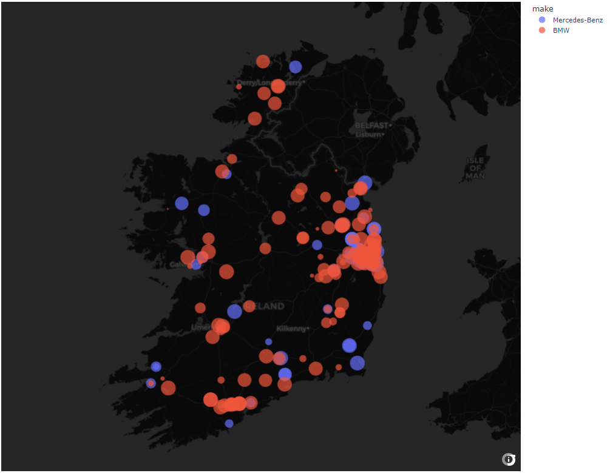

Get car listings from donedeal.ie

## Usage:

```python
import DoneDeal as dd

# Initialize scraping object
scraper = dd.CarScraper()

# Search for Mercedes E-Class and BMW 3 Series in Ireland with mileage under 140,000km and price under 20,000
# This is just formatting the search URL
scraper.set_make_model(make='Mercedes-Benz', model='E-Class') 
scraper.set_make_model(make='BMW', model='3-Series')
scraper.set_mileage(mileage_to=140_000)
scraper.set_price(price_to=20_000)

# Start scraping
scraper.scrape(batch_size=500)

# Access scraped data
df = scraper.DataFrame  # pandas.DataFrame
```
## Install:
To clone the repository and run the test script, follow these steps:

1. Open the command prompt.
2. Navigate to the directory where you want to clone the repository. Use the following commands:
```
cd C:\path\to\desired\location
git clone https://github.com/Andrewnolan13/DoneDeal.git
```
## Test:
After the repository is cloned, navigate to the `DoneDeal/tests` directory and run `Mercedes.py`:
```
cd DoneDeal/tests
python Mercedes.py
```
This will execute the `Mercedes.py` script and display a plot in your browser.

<!--  -->
### Built-in Data cleaning functions:
```python
#cleaning/formatting + features
df:pd.DataFrame = scraper.DataFrame.copy()
df=df[dd.constants.RECOMMENDED_COLUMNS] #alot of data gets returned, RECOMMENDED_COLUMNS is an optional subset of columns 

df=(df.pipe(dd.data_cleaning.assign_lat_lon) # turns string 'x,y' into (float(x),float(y))
      .pipe(dd.data_cleaning.assign_mileage) # turns string 'x km' or 'x mi' into float(x) in km (turns mi to km)
      .pipe(dd.data_cleaning.price_to_float)) # turns string 'abc,def' into float(abcdef)
df = (df.loc[lambda self:~self.price.apply(dd.data_cleaning.isBsPrice)] # drops prices like 1234,123456,123456789,111111111 etc 
        .loc[lambda self:~self.kilometers.apply(dd.data_cleaning.isBsPrice)])# sometimes the mileage is bs too. sequential digits like 123456 are just so unlikely 

```
```python
>>> df.head()
```
<table border="1" class="dataframe">
  <thead>
    <tr style="text-align: right;">
      <th></th>
      <th>make</th>
      <th>model</th>
      <th>price</th>
      <th>fuelType</th>
      <th>trim</th>
      <th>transmission</th>
      <th>engine</th>
      <th>enginePower</th>
      <th>acceleration</th>
      <th>seats</th>
      <th>numDoors</th>
      <th>colour</th>
      <th>country</th>
      <th>owners</th>
      <th>roadTax</th>
      <th>NCTExpiry</th>
      <th>bodyType</th>
      <th>year</th>
      <th>currency</th>
      <th>sellerType</th>
      <th>county</th>
      <th>countyTown</th>
      <th>header</th>
      <th>friendlyUrl</th>
      <th>lat</th>
      <th>lon</th>
      <th>kilometers</th>
    </tr>
  </thead>
  <tbody>
    <tr>
      <th>0</th>
      <td>Mercedes-Benz</td>
      <td>500</td>
      <td>17500.0</td>
      <td>Petrol</td>
      <td>NaN</td>
      <td></td>
      <td>5.0 L</td>
      <td>NaN</td>
      <td>NaN</td>
      <td>4</td>
      <td></td>
      <td>Grey</td>
      <td>Ireland</td>
      <td>3</td>
      <td></td>
      <td>May 2025</td>
      <td>Coupe</td>
      <td>1987</td>
      <td>EUR</td>
      <td>PRIVATE</td>
      <td>Co. Dublin</td>
      <td>Dublin 16</td>
      <td>1987 Mercedes-Benz 500</td>
      <td>https://www.donedeal.ie/cars-for-sale/1987-mercedes-benz-500/35499157</td>
      <td>53.255728</td>
      <td>-6.296347</td>
      <td>99000.000</td>
    </tr>
    <tr>
      <th>1</th>
      <td>Mercedes-Benz</td>
      <td>SLK-Class</td>
      <td>19995.0</td>
      <td>Diesel</td>
      <td>SPORT</td>
      <td>Automatic</td>
      <td>2.1 L</td>
      <td>204 hp</td>
      <td>6.7 sec</td>
      <td>2</td>
      <td>2</td>
      <td>Blue</td>
      <td>Ireland</td>
      <td>2</td>
      <td>280</td>
      <td>Jul 2025</td>
      <td>Convertible</td>
      <td>2014</td>
      <td>EUR</td>
      <td>PRO</td>
      <td>Co. Mayo</td>
      <td>Ballina</td>
      <td>141 MERCEDES SLK 250CDI AUTO AMG - LOW MILES -</td>
      <td>https://www.donedeal.ie/cars-for-sale/141-mercedes-slk-250cdi-auto-amg-low-miles-/36950512</td>
      <td>54.114950</td>
      <td>-9.155069</td>
      <td>111688.196</td>
    </tr>
    <tr>
      <th>2</th>
      <td>Mercedes-Benz</td>
      <td>S-Class</td>
      <td>11999.0</td>
      <td>Diesel</td>
      <td>NaN</td>
      <td>Automatic</td>
      <td>3.0 L</td>
      <td>NaN</td>
      <td>NaN</td>
      <td>5</td>
      <td>4</td>
      <td>Silver</td>
      <td>Ireland</td>
      <td>9</td>
      <td>1250</td>
      <td>Jan 2025</td>
      <td>Saloon</td>
      <td>2010</td>
      <td>EUR</td>
      <td>PRIVATE</td>
      <td>Co. Dublin</td>
      <td>South County</td>
      <td>Mercedes-Benz S-Class</td>
      <td>https://www.donedeal.ie/cars-for-sale/mercedes-benz-s-class/33603970</td>
      <td>53.269971</td>
      <td>-6.224923</td>
      <td>110000.000</td>
    </tr>
    <tr>
      <th>3</th>
      <td>Mercedes-Benz</td>
      <td>E-Class</td>
      <td>10999.0</td>
      <td>Diesel</td>
      <td>Classic</td>
      <td>Automatic</td>
      <td>2.1 L</td>
      <td>136 hp</td>
      <td>9.5 sec</td>
      <td>5</td>
      <td>4</td>
      <td>Black</td>
      <td>Ireland</td>
      <td>5</td>
      <td>280</td>
      <td>Nov 2024</td>
      <td>Saloon</td>
      <td>2013</td>
      <td>EUR</td>
      <td>PRO</td>
      <td>Co. Dublin</td>
      <td>Dublin 15</td>
      <td>Mercedes-Benz E-Class 200 CDI Blue Efficiency ECO</td>
      <td>https://www.donedeal.ie/cars-for-sale/mercedes-benz-e-class-200-cdi-blue-efficiency-eco/37552808</td>
      <td>53.390700</td>
      <td>-6.381690</td>
      <td>135999.000</td>
    </tr>
    <tr>
      <th>4</th>
      <td>Mercedes-Benz</td>
      <td>E-Class</td>
      <td>17500.0</td>
      <td>Diesel</td>
      <td>CLASSIC</td>
      <td>Automatic</td>
      <td>2.1 L</td>
      <td>136 hp</td>
      <td>9.5 sec</td>
      <td>5</td>
      <td>4</td>
      <td>Black</td>
      <td>Ireland</td>
      <td>3</td>
      <td>200</td>
      <td>Mar 2025</td>
      <td>Saloon</td>
      <td>2015</td>
      <td>EUR</td>
      <td>PRIVATE</td>
      <td>Co. Dublin</td>
      <td>Clondalkin</td>
      <td>Mercedes Benz E220 2015</td>
      <td>https://www.donedeal.ie/cars-for-sale/mercedes-benz-e220-2015/37024503</td>
      <td>53.327529</td>
      <td>-6.400042</td>
      <td>206000.000</td>
    </tr>
  </tbody>
</table>
